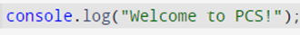
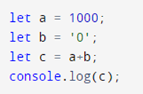
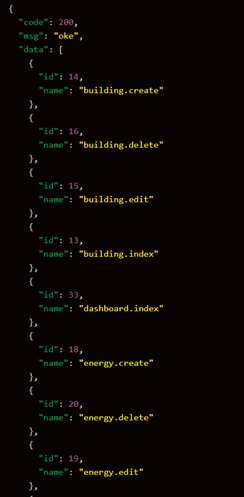
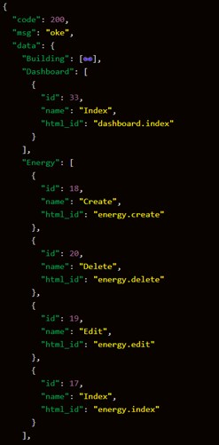
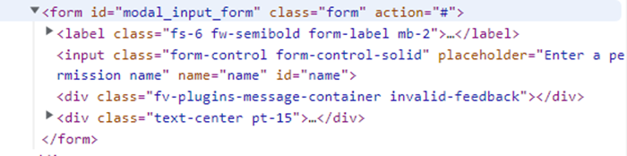

## Soal Front-End Developer :

1. Jelaskan pengertian SEO menurut pemahamanmu (html)

> SEO (Search Engine Optimization) adalah proses meningkatkan kualitas dan jumlah trafik pada website melalui hasil pencarian dari search engine, seperti Google, Bing, Yandex, atau Yahoo dengan cara mengoptimalkan konten dan struktur website serta meningkatkan relevansi dan visibilitas website.

2.  Jelaskan perbedaan antara cookie, sessionStorage dan localStorage! (js)

> 1. Cookie: Sebuah data berbentuk file teks kecil yang dikirim oleh server dan disimpan di perangkat klien. Cookie dapat digunakan untuk mengingat preferensi pengguna, menyimpan data login, dan lainnya. Apabila browser ditutup maka cookie masih bisa digunakan sesuai dengan waktu yang telah ditentukan.
> 2. sessionStorage: Data yang disimpan dalam sessionStorage akan hilang setelah pengguna menutup jendela atau tab browser.
> 3. localStorage: localStorage mirip dengan sessionStorage, tetapi data yang disimpan dalam localStorage tetap ada setelah pengguna menutup jendela atau tab browser.

3.  Sebutkan perbedaan antara GET dan POST! (general)

> - GET digunakan untuk mengambil data dari server, sedangkan POST digunakan untuk mengirim data ke server.
> - GET akan menampilkan data pada URL, kemudian akan ditampung oleh action, sedangkan POST akan mengirimkan data langsung ke action untuk ditampung, tanpa menampilkan pada URL.
> - GET menggunakan variable `$_GET` untuk menampung data, sedangkan POST menggunakan variable `$_POST` untuk menampung data.

4.  Jelaskan z-index dan bagaimana susunan konteks terbentuk. (css)

> z-index adalah properti CSS yang digunakan untuk menentukan tingkat kedalaman elemen dalam halaman web.
> Susunan konteks dibentuk dengan menempatkan elemen dalam halaman web dalam lapisan yang sesuai dengan z-index nya. Elemen dengan z-index yang lebih rendah akan berada di lapisan bawah dan elemen dengan z-index yang lebih tinggi akan berada di lapisan atas. Jika dua elemen memiliki z-index yang sama, elemen yang terakhir ditambahkan ke halaman akan tampak di atas elemen yang ditambahkan sebelumnya.

5.  Sebutkan metode untuk menyembunyikan suatu konten secara visual dan membuatnya tersedia hanya untuk pembaca layar / _screen reader_! (css)

> - CSS: menambahkan atribut `display:none` atau `visibility:hidden` pada properti elemen. 
> - ARIA (Accessible Rich Internet Applications): menambahkan atribut `aria-hidden="true"` pada properti elemen. 
> - HTML : menambahkan atribut `hidden` pada properti elemen.
> - JavaScript: menambahkan `.style.display:none` dalam tag javascript.

6.  Jelaskan cara kerja _this_ dalam JavaScript! (js)

> *this* di javascript mengacu pada object dimana *this* ini berada. Contohnya adalah sebagai berikut:
> 
    
    let firstName = "Jane";
    const person = {
      firstName: "John",
      lastName: "Doe",
      fullName : function() {
        return this.firstName + " " + this.lastName;
      }
    };
    console.log(person.fullName()); // "John Doe"
    
> Dari contoh diatas, berarti *this* disini adalah merujuk ke `person`. `this` pada kode di atas mengarahkan string "John" untuk diisi pada variabel `firstName`. Jika kode di atas tidak menggunakan this, dan hanya menggunakan `return firstName ...`, maka yang terpanggil adalah Jane, dan hasilnya menjadi **Jane Doe**. Jika kode di atas `return this.firstName ...`, maka yang terpanggil adalah John, dan hasilnya menjadi **John Doe**.

7. Sebutkan minimal 3 framework js yang kamu ketahui dan berikan nilai kemampuan kamu dalam menggunakan ke 3 framework tersebut. (js)

> 1. **React.js** adalah framework JavaScript yang digunakan untuk membuat aplikasi web yang dinamis, interaktif, dan responsif. Kelebihan React.js adalah menggunakan Virtual DOM, yang membuat aplikasi menjadi lebih cepat untuk di muat. Nilai kemampuan saya dalam menggunakan React.js adalah 7 dari 10.
> 2. **Vue.js** adalah framework JavaScript yang digunakan untuk membuat aplikasi web yang interaktif, mudah digunakan, dan mudah untuk dikembangkan. Saya saat ini sedang belajar untuk membuat project website dengan Vue.js karena Vue.js lebih mudah dipelajari bila dibandingkan dengan React.js. Nilai kemampuan saya dalam menggunakan Vue.js adalah 5 dari 10.
> 3. **Angular.js** adalah framework JavaScript yang digunakan untuk membuat aplikasi web. Saya belum pernah membuat project website dengan Angular.js, tetapi saya pernah membaca konsep dasar Angular, seperti komponen, direktori, dan menggunakan MVC (Model-View-Controller) sama seperti CodeIgniter. Nilai kemampuan saya dalam menggunakan Angular.js adalah 2 dari 10.

8.  Jelaskan bagaimana kinerja  asynchronous pada javascript, kalau bisa dengan kodingan. (js)

> Asynchronous pada JavaScript adalah cara untuk mengeksekusi kode tanpa harus menunggu kode lain untuk selesai dieksekusi. Asynchronous dapat dilakukan dengan menggunakan callback, promises, atau async/await.
> 1. **Callback**: Callback adalah fungsi yang ditetapkan sebagai parameter dari fungsi lain, yang akan dijalankan setelah fungsi utama selesai dieksekusi. Contoh:
> 

    function getData(callback) {
        setTimeout(() => {
            let data = 'Hello, I am callback data';
            callback(data);
        }, 2000);
    }
    
    getData(function(data) {
        console.log(data);
    });
    
    console.log('This will be logged first');

> Kode di atas menggunakan callback, fungsi `getData` menerima satu parameter yaitu `callback`. Kemudian `setTimeout` digunakan untuk menunda eksekusi selama 2 detik. Setelah 2 detik, `callback` dieksekusi dengan parameter data yang di passing. Kemudian di luar function `getData`, console log dilakukan untuk menampilkan hasil data yang di passing dari callback.

> 2. **Promise**: Objek yang mewakili sebuah operasi yang akan selesai di masa depan sesuai waktu yang dapat ditentukan. Contoh:
> 

    let promise = new Promise(function(resolve, reject) {
        setTimeout(() => {
            resolve('Hello, I am promise data');
        }, 2000);
    });
    
    promise.then(function(data) {
        console.log(data);
    });
    
    console.log('This will be logged first');

> Kode di atas menggunakan promise, objek promise dibuat dan di dalamnya dijalankan `setTimeout` yang digunakan untuk menunda eksekusi selama 2 detik, lalu parameter `resolve` akan dijalankan yang berisi data yang akan diterima. Kemudian pada baris selanjutnya, `promise.then` digunakan untuk menerima data yang di resolve. Kemudian di luar function `getData`, console log dilakukan untuk menampilkan hasil data yang di passing dari promise.

> 3. **Async/Await**: Fungsi yang mengandung asynchronous code harus ditandai dengan `async` dan kode asynchronous harus ditulis dalam blok `await`. Contoh:
> 

    async function getData() {
        let promise = new Promise((resolve, reject) => {
            setTimeout(() => resolve("Hello, I am async/await data"), 2000)
        });
    
        let data = await promise;
        console.log(data);
    }
    
    getData();
    console.log('This will be logged first');

> Kode di atas menggunakan async/await, function `getData` di tandai dengan keyword `async` agar function bisa menggunakan await. Kemudian dibuat `promise` yang sama seperti kode sebelumnya, kemudian variable `data` dideklarasikan dengan menggunakan `await` dan diisi dengan `promise` yang telah dibuat. Kemudian console log dilakukan untuk menampilkan hasil data yang di passing dari promise.

9.  Jelaskan perbedaan SPA dan PWA (general)

> - **SPA (Single-Page Application)** adalah aplikasi web yang hanya memuat satu halaman dan mengambil data dari server saat diperlukan. Halaman web tidak di-reload selama pengguna berinteraksi dengan aplikasi, sehingga memberikan kesan seperti aplikasi desktop atau mobile. **PWA (Progressive Web App)** adalah aplikasi web yang dikembangkan dengan teknologi web modern dan mengikuti standar web, sehingga dapat diinstall dan dijalankan seperti aplikasi native. PWA memiliki fitur-fitur seperti notifikasi, akses offline, dan dapat diinstall di homescreen.
> - SPA biasanya dibangun dengan menggunakan framework seperti React, Angular, Vue.js, dan lainnya. Sementara PWA dibangun dengan menggunakan teknologi web modern seperti service worker, web manifest, dan teknologi lain yang memungkinkan aplikasi dapat diinstall dan dijalankan seperti aplikasi native.

10.  Jelaskan dan berikan contoh Promise. (js)

> Promise adalah objek yang mewakili sebuah operasi yang akan selesai di masa depan sesuai waktu yang dapat ditentukan. Promises memiliki 3 kondisi yaitu fulfilled (selesai), rejected (gagal) dan pending (masih berjalan). Promise dibuat menggunakan konstruktor `Promise`, yang menerima satu parameter yaitu fungsi yang menerima dua argument, `resolve` dan `reject`. Fungsi ini dijalankan saat promise dibuat dan digunakan untuk menyelesaikan atau menolak promise. Contoh promise:

    let promise = new Promise(function(resolve, reject) {
        setTimeout(() => {
            resolve('Hello, I am promise data');
        }, 2000);
    });
    
    promise.then(function(data) {
        console.log(data);
    });

> Dalam contoh di atas, dibuat objek `promise` dengan menggunakan contructor `Promise`. Kemudian `setTimeout` digunakan untuk menunda eksekusi selama 2000 ms atau 2 detik. Setelah 2 detik, promise akan di `resolve` dengan data `Hello, I am promise data`. Kemudian data yang di resolve dapat diakses dengan menggunakan method `.then` yang menerima satu parameter yaitu fungsi yang akan dijalankan saat promise selesai. Selain method `.then`, promise juga memiliki method lain yaitu:
> - `.catch` : digunakan untuk menangani promise yang di reject.
> - `.finally` : digunakan untuk mengeksekusi kode setelah promise selesai baik di resolve atau di reject.

11.  Buatkan hasil dari perintah berikut : (Js)

a. 
> `Welcome to PCS!`

b. 
> `10000`

12.  Diberikan contoh data sebagai berikut table kiri, lalu ubahlah data tersebut menjadi table kanan : (js)

 

13.  Buatkanlah function untuk mendapatkan suhu hari ini pada derajat celcius menggunakan open api cuaca (ex developer.accuweather)

> 

    const request = require('request');

    function getWeather() {
	    const apiKey = 'API_KEY';
	    const location = 'LOCATION_ID';
	    const url = `http://dataservice.accuweather.com/currentconditions/v1/${location}?apikey=${apiKey}`;

	    request(url, { json: true }, (err, res, body) => {
		    if (err) {
		      console.log(err);
		      return;
		    }
    
	    console.log(`Suhu saat ini adalah ${body[0].Temperature.Metric.Value} derajat Celcius`);
	    });
    }
    
    getWeather();

> Kode di atas merupakan sebuah fungsi JavaScript yang digunakan untuk mendapatkan suhu saat ini dari OpenAPI cuaca AccuWeather dalam derajat Celcius. Pertama, function memanggil library `request` yang digunakan untuk mengirim permintaan HTTP ke server AccuWeather. Kemudian, di dalam function tersebut, ada const `apiKey` dan `location` yang digunakan sebagai input pada permintaan API. `apiKey` digunakan untuk mengidentifikasi aplikasi ke server AccuWeather, sedangkan `location` digunakan untuk menentukan lokasi yang ingin ditampilkan suhunya. 
> 
> Kemudian, dibuat sebuah variabel `url` yang digunakan sebagai alamat API yang akan dituju. berarti alamat API yang digunakan adalah `http://dataservice.accuweather.com/currentconditions/v1/${location}?apikey=${apiKey}` yang digunakan untuk mengambil data cuaca saat ini dari lokasi yang telah ditentukan.
>
> Selanjutnya, function menggunakan method `request()` untuk mengirim permintaan HTTP ke alamat API yang telah ditentukan. Dalam method tersebut, opsi yang digunakan yaitu `json: true` yang digunakan untuk mendefinisikan data yang diterima dalam format JSON.
>
> Dalam callback function yang digunakan dalam method `request()`, terdapat pengecekan error `if (err)`. Jika terjadi error, maka akan menampilkan pesan error. Namun jika tidak ada error, maka akan menampilkan suhu saat ini dari lokasi yang telah ditentukan dalam derajat Celcius.

14.  Diberikan sebuah html seperti berikut :

Buatkanlah kodingan menggunakan javascript, untuk mengisi div dengan class invalid-feedback, pertimbangkan juga jika ada banyak div yang memiliki class invalid-feedback (js)

> 

    const form = document.getElementById("modal_input_form");
    
    form.addEventListener("submit", function(event) {
      event.preventDefault();
      
      const input = form.querySelector("input[name='name']");
      const invalidFeedbackDivs = form.querySelectorAll(".invalid-feedback");
      
      if (!input.value) {
        invalidFeedbackDivs.forEach((div) => {
          div.textContent = "Permission name is required";
        });
      } else {
        invalidFeedbackDivs.forEach((div) => {
          div.textContent = "";
        });
      }
    });

> Kode diatas akan mengambil form dengan id `modal_input_form` dan menambahkan event listener pada event submit. Pada event tersebut, kodingan akan mengecek apakah input name kosong atau tidak. Jika kosong, maka div dengan class `invalid-feedback` akan diisi dengan pesan "**Permission name is required**", sebaliknya jika tidak kosong maka div dengan class `invalid-feedback` akan diisi dengan string kosong atau tidak akan ada pesan yang ditampilkan.
> 
> Singkatnya kode di atas digunakan untuk memvalidasi apakah input pada form sudah diisi atau belum. Jika tidak diisi maka akan muncul pesan error pada div yang memiliki class `invalid-feedback`.

15.  Jelaskan strategi - strategi caching yang kamu ketahui (js) 

> - Cache Aside: Aplikasi menangani pengambilan dan penyimpanan data ke cache secara manual. Aplikasi mengecek cache untuk data yang dibutuhkan sebelum mengambil dari sumber data asli. Jika data tidak ditemukan di cache, maka data tersebut diambil dari sumber data asli dan disimpan di cache untuk digunakan di waktu yang lain.
> - Read Through: Cache diintegrasikan dengan aplikasi sehingga ketika aplikasi meminta data, cache akan secara otomatis mengecek apakah data tersebut ada di cache. Jika tidak, data tersebut diambil dari sumber data asli dan disimpan di cache untuk digunakan di waktu yang lain.
> - Write Through: Setiap kali aplikasi menulis data, data tersebut disimpan ke cache dan juga ke sumber data asli secara bersamaan.
> - Write Behind: Setiap kali aplikasi menulis data, data tersebut disimpan ke cache dahulu. Kemudian cache akan menyimpan data tersebut ke sumber data asli di latar belakang.
> - Refresh Ahead: Cache secara periodik memperbarui data yang ada di cache dengan data yang baru dari sumber data asli.

16.  Jelaskan bagaimana kerja service-worker pada javascript, berikan contoh kodingan jika kamu pernah menggunakannya. (general)

> Service worker adalah script yang dijalankan di latar belakang oleh browser yang dapat digunakan untuk meningkatkan kinerja dan ketersediaan aplikasi web. Service worker dapat digunakan untuk menyimpan aset dalam cache, membuat aplikasi bekerja offline, dan melakukan operasi lain yang tidak mungkin dilakukan oleh script JavaScript biasa. Berikut contoh kodenya:

> File index.html :

    <!DOCTYPE html>
    <html>
    <head>
        <title>My App</title>
    </head>
    <body>
        <h1>Welcome to My App</h1>
        
    </body>
    </html>

> File main.js :

    if ('serviceWorker' in navigator) {
        navigator.serviceWorker.register('/sw.js')
        .then(function(registration) {
            console.log('Service worker registration successful:', registration);
        })
        .catch(function(error) {
            console.log('Service worker registration failed:', error);
        });
    }

    
> File sw.js :

    self.addEventListener('install', function(event) {
        event.waitUntil(
            caches.open('my-app-cache').then(function(cache) {
                return cache.addAll([
                    '/',
                    '/index.html',
                    '/main.js'
                ]);
            })
        );
    });
    
    self.addEventListener('fetch', function(event) {
        event.respondWith(
            caches.match(event.request).then(function(response) {
                return response || fetch(event.request);
            })
        );
    });

17.  Buatlah sebuah grafik semenarik mungkin, untuk menghitung : (js+css)

a. Berapa banyak sub kategori pada setiap kategorinya(pada kasus di atas, dashboard, energy, building merupakan kategori).

b. Berapa banyak total sub kategori setiap sub kategorinya (pada kasus di atas, sub kategori adalah, index, create, delete)
